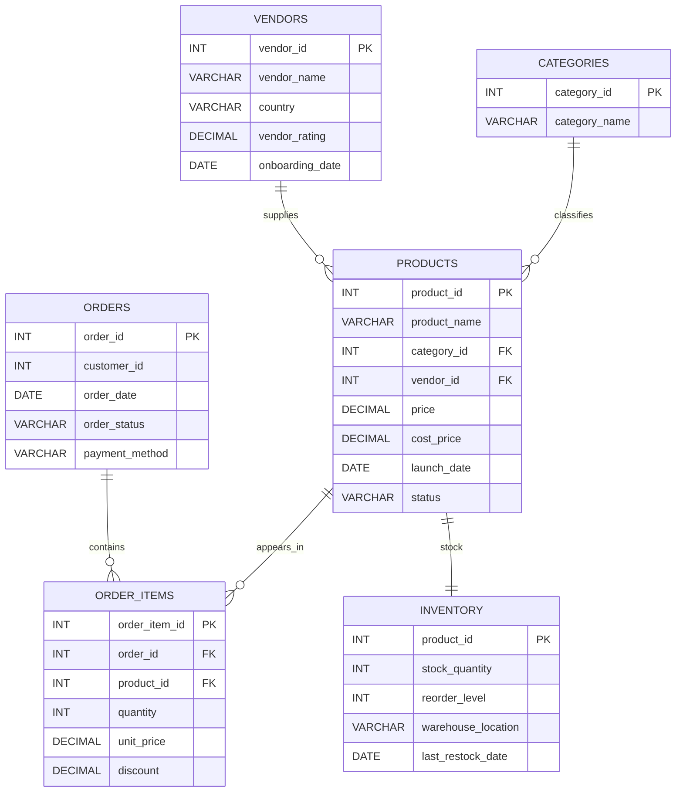

# 📊 E-commerce Vendor Performance Analysis (SQL Project)

## 📌 Project Overview

This project analyses **vendor performance, product sales, category trends, and inventory health** for an e-commerce platform using SQL.

The goal of this project is to generate insights that help businesses:

📈 Improve vendor performance  
📦 Optimise product selection  
🛒 Monitor product demand  
⚠️ Identify inventory risks  

The analysis simulates real-world **e-commerce data analysis used by large online retail platforms**.

---

# 🎯 Business Problem

E-commerce platforms manage multiple vendors, thousands of products, and daily transactions. Understanding vendor and product performance is essential for improving revenue and operational efficiency.

This project answers key business questions such as:

🏆 Which vendors generate the most revenue?

📦 Which products drive the highest sales?

📊 Which categories perform best?

⚠️ Which products are at risk of stockout?

🛒 Are there products listed but never sold?

These insights help businesses improve **vendor management, product strategy, and inventory planning**.

---

# 🗄 Database Schema

The dataset contains **6 relational tables** representing vendors, Categories, products, orders, Order Items and inventory.

---

# 🗺️ Entity Relationship Diagram (ERD)


---


## What the relationships mean
- One **vendor** can supply many **products**
- One **category** can contain many **products**
- One **order** can contain many **order items**
- One **product** can appear in many **order items**
- One **product** has one **inventory record**

---

## 🔍 Key Analysis Performed

The analysis covers multiple business areas.
- Assumption used in revenue calculations
  For all sales/revenue queries, I used: quantity * unit_price * (1 - discount / 100.0) And I counted only: order_status = 'Completed'

### 🏢 Vendor Performance Analysis

1) Total revenue generated by each vendor
``` sql
SELECT
    v.vendor_id,
    v.vendor_name,
    ROUND(SUM(oi.quantity * oi.unit_price * (1 - oi.discount / 100.0)), 2) AS total_revenue
FROM vendors v
JOIN products p
    ON v.vendor_id = p.vendor_id
JOIN order_items oi
    ON p.product_id = oi.product_id
JOIN orders o
    ON oi.order_id = o.order_id
WHERE o.order_status = 'Completed'
GROUP BY v.vendor_id, v.vendor_name
ORDER BY total_revenue DESC;

```
2) Vendor ranking based on revenue
``` sql
WITH vendor_revenue AS (
    SELECT
        v.vendor_id,
        v.vendor_name,
        ROUND(SUM(oi.quantity * oi.unit_price * (1 - oi.discount / 100.0)), 2) AS total_revenue
    FROM vendors v
    JOIN products p
        ON v.vendor_id = p.vendor_id
    JOIN order_items oi
        ON p.product_id = oi.product_id
    JOIN orders o
        ON oi.order_id = o.order_id
    WHERE o.order_status = 'Completed'
    GROUP BY v.vendor_id, v.vendor_name
)
SELECT
    vendor_id,
    vendor_name,
    total_revenue,
    RANK() OVER (ORDER BY total_revenue DESC) AS vendor_rank
FROM vendor_revenue
ORDER BY vendor_rank;

```
3) Vendors generating revenue above average vendor revenue
``` sql
WITH vendor_revenue AS (
    SELECT
        v.vendor_id,
        v.vendor_name,
        SUM(oi.quantity * oi.unit_price * (1 - oi.discount / 100.0)) AS total_revenue
    FROM vendors v
    JOIN products p
        ON v.vendor_id = p.vendor_id
    JOIN order_items oi
        ON p.product_id = oi.product_id
    JOIN orders o
        ON oi.order_id = o.order_id
    WHERE o.order_status = 'Completed'
    GROUP BY v.vendor_id, v.vendor_name
)
SELECT
    vendor_id,
    vendor_name,
    ROUND(total_revenue, 2) AS total_revenue
FROM vendor_revenue
WHERE total_revenue > (
    SELECT AVG(total_revenue)
    FROM vendor_revenue
)
ORDER BY total_revenue DESC;
```
4) How many active products each vendor currently sells
``` sql
SELECT
    v.vendor_id,
    v.vendor_name,
    COUNT(p.product_id) AS active_product_count
FROM vendors v
LEFT JOIN products p
    ON v.vendor_id = p.vendor_id
   AND p.status = 'Active'
GROUP BY v.vendor_id, v.vendor_name
ORDER BY active_product_count DESC, v.vendor_name;

```
5) Vendors selling products across multiple categories  
``` sql
SELECT
    v.vendor_id,
    v.vendor_name,
    COUNT(DISTINCT p.category_id) AS category_count
FROM vendors v
JOIN products p
    ON v.vendor_id = p.vendor_id
GROUP BY v.vendor_id, v.vendor_name
HAVING COUNT(DISTINCT p.category_id) > 1
ORDER BY category_count DESC, v.vendor_name;
```
---

### 📦 Product Performance Analysis

6) Top 10 best-selling products by revenue
``` sql
SELECT
    p.product_id,
    p.product_name,
    ROUND(SUM(oi.quantity * oi.unit_price * (1 - oi.discount / 100.0)), 2) AS total_revenue
FROM products p
JOIN order_items oi
    ON p.product_id = oi.product_id
JOIN orders o
    ON oi.order_id = o.order_id
WHERE o.order_status = 'Completed'
GROUP BY p.product_id, p.product_name
ORDER BY total_revenue DESC
LIMIT 10;
```
7) Rank products within each category based on total revenue
``` sql
WITH product_revenue AS (
    SELECT
        c.category_name,
        p.product_id,
        p.product_name,
        ROUND(SUM(oi.quantity * oi.unit_price * (1 - oi.discount / 100.0)), 2) AS total_revenue
    FROM products p
    JOIN categories c
        ON p.category_id = c.category_id
    JOIN order_items oi
        ON p.product_id = oi.product_id
    JOIN orders o
        ON oi.order_id = o.order_id
    WHERE o.order_status = 'Completed'
    GROUP BY c.category_name, p.product_id, p.product_name
)
SELECT
    category_name,
    product_id,
    product_name,
    total_revenue,
    DENSE_RANK() OVER (PARTITION BY category_name ORDER BY total_revenue DESC) AS category_rank
FROM product_revenue
ORDER BY category_name, category_rank;
```
  
8) Products that have never been ordered
``` sql
SELECT
    p.product_id,
    p.product_name
FROM products p
LEFT JOIN order_items oi
    ON p.product_id = oi.product_id
WHERE oi.product_id IS NULL
ORDER BY p.product_id; 
```
9) Highest revenue-contributing products for each vendor
``` sql
WITH vendor_product_revenue AS (
    SELECT
        v.vendor_name,
        p.product_id,
        p.product_name,
        ROUND(SUM(oi.quantity * oi.unit_price * (1 - oi.discount / 100.0)), 2) AS total_revenue
    FROM vendors v
    JOIN products p
        ON v.vendor_id = p.vendor_id
    JOIN order_items oi
        ON p.product_id = oi.product_id
    JOIN orders o
        ON oi.order_id = o.order_id
    WHERE o.order_status = 'Completed'
    GROUP BY v.vendor_name, p.product_id, p.product_name
),
ranked_products AS (
    SELECT
        vendor_name,
        product_id,
        product_name,
        total_revenue,
        RANK() OVER (PARTITION BY vendor_name ORDER BY total_revenue DESC) AS revenue_rank
    FROM vendor_product_revenue
)
SELECT
    vendor_name,
    product_id,
    product_name,
    total_revenue
FROM ranked_products
WHERE revenue_rank = 1
ORDER BY vendor_name;
```
10) Profit margin for each product  
``` sql
SELECT
    product_id,
    product_name,
    price,
    cost_price,
    ROUND(price - cost_price, 2) AS profit_margin,
    ROUND(((price - cost_price) / price) * 100, 2) AS profit_margin_percentage
FROM products
ORDER BY profit_margin DESC;
```
---

### 📊 Category Analysis

11) Categories generating the highest total revenue
``` sql
SELECT
    c.category_id,
    c.category_name,
    ROUND(SUM(oi.quantity * oi.unit_price * (1 - oi.discount / 100.0)), 2) AS total_revenue
FROM categories c
JOIN products p
    ON c.category_id = p.category_id
JOIN order_items oi
    ON p.product_id = oi.product_id
JOIN orders o
    ON oi.order_id = o.order_id
WHERE o.order_status = 'Completed'
GROUP BY c.category_id, c.category_name
ORDER BY total_revenue DESC;
```
12) Average product price in each category
``` sql
SELECT
    c.category_id,
    c.category_name,
    ROUND(AVG(p.price), 2) AS avg_product_price
FROM categories c
JOIN products p
    ON c.category_id = p.category_id
GROUP BY c.category_id, c.category_name
ORDER BY avg_product_price DESC;
```  
13) Rank categories based on total quantity sold
``` sql
WITH category_quantity AS (
    SELECT
        c.category_name,
        SUM(oi.quantity) AS total_quantity_sold
    FROM categories c
    JOIN products p
        ON c.category_id = p.category_id
    JOIN order_items oi
        ON p.product_id = oi.product_id
    JOIN orders o
        ON oi.order_id = o.order_id
    WHERE o.order_status = 'Completed'
    GROUP BY c.category_name
)
SELECT
    category_name,
    total_quantity_sold,
    RANK() OVER (ORDER BY total_quantity_sold DESC) AS category_rank
FROM category_quantity
ORDER BY category_rank;
```

---

### 📈 Sales Trend Analysis

14) Monthly revenue trends
``` sql
SELECT
    TO_CHAR(DATE_TRUNC('month', o.order_date), 'YYYY-MM') AS order_month,
    ROUND(SUM(oi.quantity * oi.unit_price * (1 - oi.discount / 100.0)), 2) AS monthly_revenue
FROM orders o
JOIN order_items oi
    ON o.order_id = oi.order_id
WHERE o.order_status = 'Completed'
GROUP BY DATE_TRUNC('month', o.order_date)
ORDER BY DATE_TRUNC('month', o.order_date);
``` 
15) Month with the highest sales revenue
``` sql
SELECT
    TO_CHAR(DATE_TRUNC('month', o.order_date), 'YYYY-MM') AS order_month,
    ROUND(SUM(oi.quantity * oi.unit_price * (1 - oi.discount / 100.0)), 2) AS monthly_revenue
FROM orders o
JOIN order_items oi
    ON o.order_id = oi.order_id
WHERE o.order_status = 'Completed'
GROUP BY DATE_TRUNC('month', o.order_date)
ORDER BY monthly_revenue DESC
LIMIT 1;
```  
16) Month-on-month revenue growth  
``` sql
WITH monthly_revenue AS (
    SELECT
        DATE_TRUNC('month', o.order_date) AS order_month,
        SUM(oi.quantity * oi.unit_price * (1 - oi.discount / 100.0)) AS revenue
    FROM orders o
    JOIN order_items oi
        ON o.order_id = oi.order_id
    WHERE o.order_status = 'Completed'
    GROUP BY DATE_TRUNC('month', o.order_date)
)
SELECT
    TO_CHAR(order_month, 'YYYY-MM') AS order_month,
    ROUND(revenue, 2) AS current_month_revenue,
    ROUND(LAG(revenue) OVER (ORDER BY order_month), 2) AS previous_month_revenue,
    ROUND(revenue - LAG(revenue) OVER (ORDER BY order_month), 2) AS revenue_change,
    ROUND(
        ((revenue - LAG(revenue) OVER (ORDER BY order_month))
        / NULLIF(LAG(revenue) OVER (ORDER BY order_month), 0)) * 100,
        2
    ) AS growth_percentage
FROM monthly_revenue
ORDER BY order_month;
```
---

### 🚚 Inventory & Supply Chain Analysis

17) Products below reorder level
``` sql
SELECT
    i.product_id,
    p.product_name,
    i.stock_quantity,
    i.reorder_level,
    i.warehouse_location
FROM inventory i
JOIN products p
    ON i.product_id = p.product_id
WHERE i.stock_quantity < i.reorder_level
ORDER BY i.stock_quantity ASC;
```
18) Products at risk of stockout based on stock and sales
``` sql
WITH product_sales AS (
    SELECT
        p.product_id,
        p.product_name,
        COALESCE(SUM(oi.quantity), 0) AS total_units_sold,
        i.stock_quantity,
        i.reorder_level
    FROM products p
    JOIN inventory i
        ON p.product_id = i.product_id
    LEFT JOIN order_items oi
        ON p.product_id = oi.product_id
    LEFT JOIN orders o
        ON oi.order_id = o.order_id
       AND o.order_status = 'Completed'
    GROUP BY p.product_id, p.product_name, i.stock_quantity, i.reorder_level
)
SELECT
    product_id,
    product_name,
    total_units_sold,
    stock_quantity,
    reorder_level,
    CASE
        WHEN stock_quantity < reorder_level THEN 'Reorder Immediately'
        WHEN stock_quantity <= total_units_sold THEN 'Stockout Risk'
        ELSE 'Healthy'
    END AS stock_status
FROM product_sales
ORDER BY total_units_sold DESC, stock_quantity ASC;
```
19) Products with high inventory but low sales  
``` sql
WITH product_sales AS (
    SELECT
        p.product_id,
        p.product_name,
        COALESCE(SUM(CASE WHEN o.order_status = 'Completed' THEN oi.quantity END), 0) AS total_units_sold,
        i.stock_quantity
    FROM products p
    JOIN inventory i
        ON p.product_id = i.product_id
    LEFT JOIN order_items oi
        ON p.product_id = oi.product_id
    LEFT JOIN orders o
        ON oi.order_id = o.order_id
    GROUP BY p.product_id, p.product_name, i.stock_quantity
)
SELECT
    product_id,
    product_name,
    stock_quantity,
    total_units_sold
FROM product_sales
WHERE stock_quantity > 50
  AND total_units_sold < 2
ORDER BY stock_quantity DESC, total_units_sold ASC;
```
---

### ⚙️ Order & Operational Analysis

20) Total number of orders by order status
``` sql
SELECT
    order_status,
    COUNT(*) AS total_orders
FROM orders
GROUP BY order_status
ORDER BY total_orders DESC;
```  
21) Percentage of cancelled orders
``` sql
SELECT
    COUNT(*) AS total_orders,
    SUM(CASE WHEN order_status = 'Cancelled' THEN 1 ELSE 0 END) AS cancelled_orders,
    ROUND(
        SUM(CASE WHEN order_status = 'Cancelled' THEN 1 ELSE 0 END) * 100.0 / COUNT(*),
        2
    ) AS cancelled_order_percentage
FROM orders;
``` 
22) Most commonly used payment method
``` sql
SELECT
    payment_method,
    COUNT(*) AS usage_count
FROM orders
GROUP BY payment_method
ORDER BY usage_count DESC
LIMIT 1;
```

---

# 💡 Insights

The SQL analysis revealed several important insights about vendor performance, product demand, and operational efficiency.

---

## 🏢 Vendor Performance Insights

- **FitGear** is the top-performing vendor, generating the highest revenue of **$612.50**, indicating strong demand for its fitness products.
- **TechNova** ranks second with **$428.50**, showing strong performance in the electronics category.
- The top four vendors (**FitGear, TechNova, KitchenPro, and KitchenElite**) generate revenue **above the platform average**, indicating that a small number of vendors contribute significantly to overall sales.
- **KitchenElite and TechNova** have the highest product count (3 active products), which may contribute to higher sales opportunities.
- **TechNova** is the only vendor currently selling products across **multiple categories**, suggesting a diversified product strategy.

---

## 📦 Product Performance Insights

- The **Treadmill** is the highest revenue-generating product (**$552.50**), significantly outperforming other products in the catalog.
- **Wireless Earbuds** and **Smart Watch** are the top-performing electronics products, indicating strong demand in the electronics category.
- Two products — **Smart Desk Organizer** and **Portable Juicer** — have **never been ordered**, suggesting potential issues with product visibility, pricing, or demand.
- Several vendors rely heavily on a **single product** for most of their revenue (e.g., FitGear with the Treadmill), indicating potential risk if demand declines.
- Some products such as **Yoga Mat, Resistance Bands, and Indoor Plant Pot** have **very high profit margins (up to 60%)**, indicating strong profitability opportunities.

---

## 📊 Category Performance Insights

- The **Fitness category** generates the highest total revenue (**$782.50**), making it the most valuable category on the platform.
- **Electronics** is the second-highest performing category (**$680.75**), driven by strong sales of smart devices.
- **Home & Living** products recorded the highest **quantity sold**, suggesting steady demand despite lower revenue compared to other categories.
- The **Fashion category** contributes the least revenue, indicating potential growth opportunities or weaker product demand.

---

## 📈 Sales Trend Insights

- Revenue shows a **consistent upward trend from January to June 2024**.
- The platform recorded its **highest monthly revenue in June 2024 ($602.50)**.
- A sharp revenue increase occurred between **February and March (+53%)**, indicating a strong growth period.
- Continued growth in **May and June** suggests improving platform performance and increasing customer demand.

---

## 🚚 Inventory & Supply Chain Insights

- No products are currently **below the reorder level**, indicating that inventory is generally well managed.
- Most products are currently in **healthy stock condition**, meaning stock levels are sufficient to meet current demand.
- However, some products such as **Yoga Mat and Memory Foam Pillow** show **high inventory but very low sales**, which may lead to excess inventory and holding costs.

---

## ⚙️ Operational Insights

- Out of **16 total orders**, **14 orders were successfully completed**, showing strong order fulfillment performance.
- The **order cancellation rate is 12.5%**, which may indicate operational or customer experience issues that require investigation.
- **Credit Card** is the most commonly used payment method (**50% of orders**), followed by other digital payment methods.

---

## 📊 Overall Business Takeaways

- The platform’s revenue is heavily influenced by **top-performing vendors and products**, particularly in the **Fitness and Electronics categories**.
- Certain products generate strong profits, while others show **low demand despite high inventory levels**, indicating potential inefficiencies in product assortment.
- Sales trends indicate **steady growth over time**, suggesting increasing platform adoption.
- Identifying **unsold products and slow-moving inventory** can help vendors optimise product listings and promotional strategies.


---

# 🛠️ Tools Used

The following tools and technologies were used in this project:

- 🐘 **PostgreSQL** – Database management and SQL query execution  
- 💻 **SQL** – Data analysis, aggregations, joins, window functions, and business insights  
- 🗂️ **Relational Database Design** – Structuring tables and defining relationships  
- 🌐 **GitHub** – Version control and project documentation  


