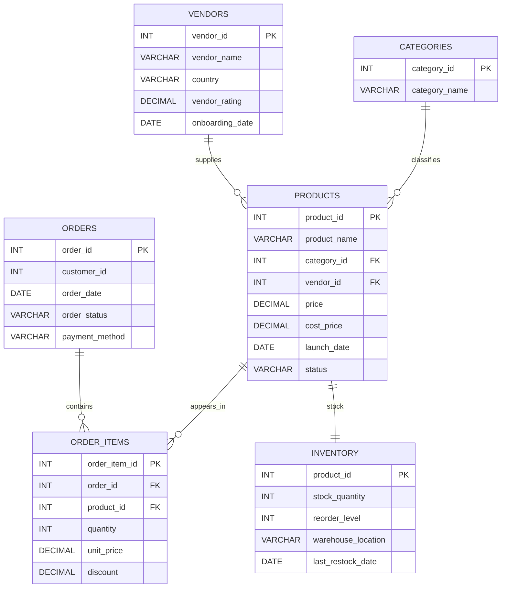

# 📊 E-commerce Vendor Performance Analysis (SQL Project)

## 📌 Project Overview

This project analyses **vendor performance, product sales, category trends, and inventory health** for an e-commerce platform using SQL.

The goal of this project is to generate insights that help businesses:

- 📈 Improve vendor performance  
- 📦 Optimise product selection  
- 🛒 Monitor product demand  
- ⚠️ Identify inventory risks  

The analysis simulates real-world **e-commerce data analysis used by large online retail platforms**.

---

# 🎯 Business Problem

E-commerce platforms manage multiple vendors, thousands of products, and daily transactions. Understanding vendor and product performance is essential for improving revenue and operational efficiency.

This project answers key business questions such as:

- 🏆 Which vendors generate the most revenue?
- 📦 Which products drive the highest sales?
- 📊 Which categories perform best?
- ⚠️ Which products are at risk of stockout?
- 🛒 Are there products listed but never sold?

These insights help businesses improve **vendor management, product strategy, and inventory planning**.

---

# 🗄 Database Schema

The dataset contains **6 relational tables** representing vendors, Categories, products, orders, Order Items and inventory.

---

# 🗺️ Entity Relationship Diagram (ERD)

---

## What the relationships mean
- One **vendor** can supply many **products**
- One **category** can contain many **products**
- One **order** can contain many **order items**
- One **product** can appear in many **order items**
- One **product** has one **inventory record**

---
